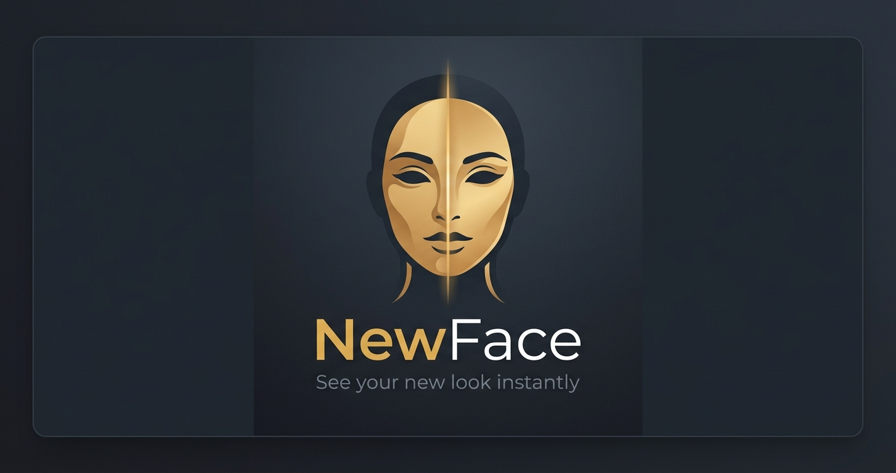

<p align="center">
  
</p>

<h1 align="center">NewFace</h1>

<p align="center">
  Real-time face swap in the browser. No Python, no NVIDIA, no install.<br>
  Just open a URL.
</p>

<p align="center">
  <a href="https://newface.live"><strong>newface.live</strong></a>
</p>

---

## What is this?

A browser-native reimplementation of [Deep-Live-Cam](https://github.com/hacksider/Deep-Live-Cam). Same AI models, same pipeline — but running entirely in the browser via **WebGPU** and **ONNX Runtime Web**.

Pick a reference face, point your webcam, choose a region (nose, lips, eyes, brow, chin, or full face) — and see the result blended onto your live video at 15–25 FPS.

**100% private.** Everything runs on your GPU. Nothing leaves your device.

---

## How it works

Five ONNX model files (~838 MB total) are downloaded once and cached in IndexedDB. After the first visit, the app loads in seconds and works offline.

| File | Role | Size | Runs on |
|------|------|------|---------|
| `det_10g.onnx` | Face detection (SCRFD) — bbox + 5 landmarks | 17 MB | WASM (CPU) |
| `w600k_r50.onnx` | Identity embedding (ArcFace) — 512-dim vector | 174 MB | WASM (CPU) |
| `inswapper_128.onnx` | Face swap — the core model | 553 MB | WebGPU |
| `bisenet.onnx` | Face parsing — per-pixel region labels | 94 MB | WebGPU |
| `emap.bin` | Projection matrix — ArcFace → InSwapper space | 1 MB | JS (CPU) |

### Pipeline

```
Reference photo (once)          Live webcam (every frame)
─────────────────────           ─────────────────────────
detect face (SCRFD)             detect face (SCRFD) [worker thread]
    ↓                               ↓
align → 112×112                 align → 128×128
    ↓                               ↓
ArcFace → 512-dim embed        InSwapper (source latent + target face)
    ↓                               ↓
× emap → latent (cached)       paste back into frame
                                    ↓
                                BiSeNet → region mask
                                    ↓
                                alpha blend + sharpen → canvas
```

The reference photo is processed **once** — the resulting latent vector is reused every frame.

---

## Features

- **Region swapping** — nose, lips, eyes, brow, chin, or full face
- **BiSeNet face parsing** — pixel-level region masks with Gaussian-feathered edges
- **Pipelined detection** — SCRFD runs in a Web Worker, parallel with GPU swap (~40% faster)
- **Adjustable controls** — blend opacity, sharpness, edge feathering, mask dilation
- **Zoom & pan** — scroll to zoom, drag to pan the preview
- **Reference presets** — built-in reference faces organized by feature category
- **Offline after first load** — all models cached in IndexedDB
- **Zero backend** — static site on Netlify, models served from GitHub Releases via edge function CORS proxy

---

## Tech stack

- **ONNX Runtime Web** `@1.22.0` — WebGPU + WASM backends
- **WebGPU** — GPU-accelerated inference (Chrome 113+, Edge 113+)
- **Web Workers** — background face detection thread
- **IndexedDB** — persistent model cache
- **Netlify Edge Functions** — CORS proxy for GitHub Releases model downloads
- **Vanilla JS** — no frameworks, no build step

---

## Run locally

```bash
# Clone
git clone https://github.com/alphastack1/new-face-live.git
cd new-face-live

# Serve with the right headers (COEP/COOP for SharedArrayBuffer)
npx serve . -l 3000
# or use any server that sets:
#   Cross-Origin-Opener-Policy: same-origin
#   Cross-Origin-Embedder-Policy: credentialless
```

Open `http://localhost:3000` in Chrome or Edge.

---

## Project structure

```
index.html              Single-page app (HTML + inline CSS + JS)
js/
  engine.js             Orchestrator — model loading, frame loop
  pipeline.js           Detection, embedding, swap, parse, blend
  models.js             IndexedDB caching, ONNX session creation
  math.js               Affine transforms, NMS, vector math
  detection-worker.js   Web Worker for SCRFD (WASM thread)
netlify.toml            Headers, redirects, edge function routing
netlify/
  edge-functions/
    models-proxy.js     CORS proxy for GitHub Releases downloads
references/             Built-in reference face images
```

---

## Inspired by

[Deep-Live-Cam](https://github.com/hacksider/Deep-Live-Cam) — the original Python + NVIDIA implementation. This project takes the same models and pipeline and runs them entirely in the browser.

---

<p align="center">
  <sub>Built with WebGPU + ONNX Runtime Web</sub>
</p>
